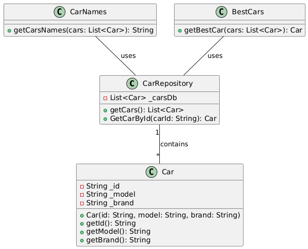
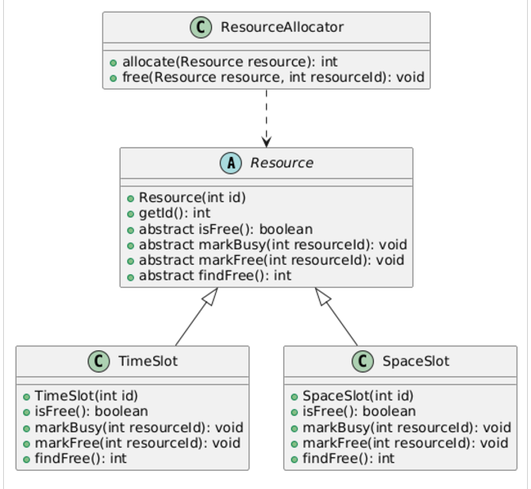
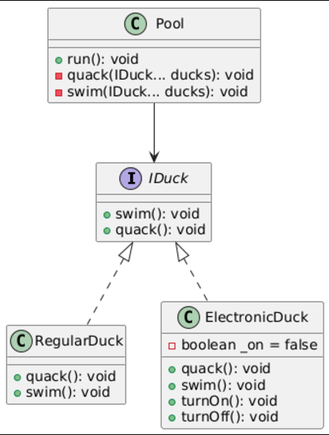
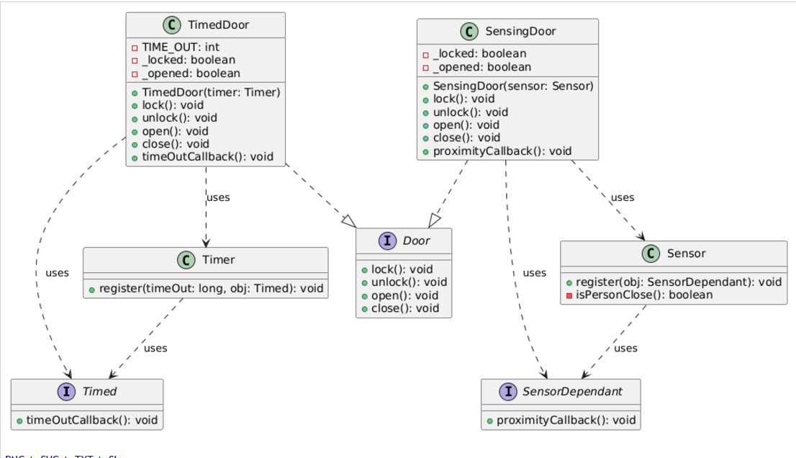
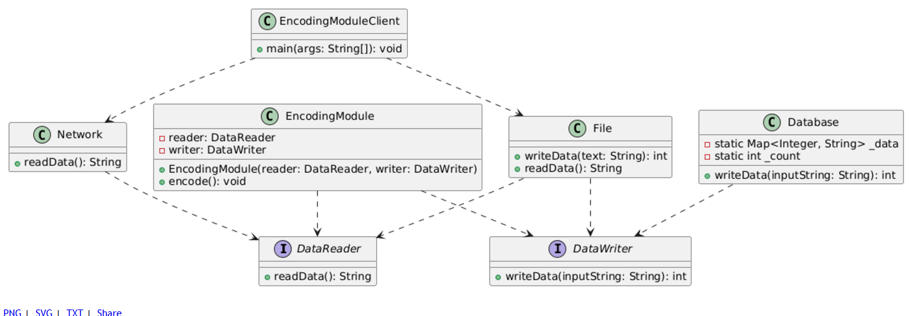

# SOLID

### 1- Single Responsibility Principle (SRP)

#### Problem

The CarManager class violates the Single Responsibility Principle (SRP) because it handles multiple responsibilities: managing a list of cars (_carsDb), calculating the best car based on the model name, and formatting car names into a string. This violates SRP as the class has multiple reasons to change, such as modifying the logic for finding the best car or changing the formatting style.

#### Solution

The solution involves splitting responsibilities into three classes: CarRepository for managing car storage and retrieval, CarMetrics for calculating metrics like the best car, and CarFormatter for formatting car data. This separation ensures each class has a single reason to change, adhering to SRP.

## Diagram

### 2- Open Closed Principal (OCP)

#### Problem

The ResourceAllocator class violates the Open/Closed Principle (OCP) because it relies on a switch statement to handle different resource types. Adding a new resource type requires modifying the allocate and free methods, making the class open for modification instead of extension.

#### Solution

The refactored solution introduces an abstract Resource class with concrete subclasses like TimeSlot and SpaceSlot, each handling its specific logic. This change ensures the ResourceAllocator class depends on abstractions, making it open for extension but closed for modification.

## Diagram

### 3- Liskov Substitution Principal (LSP)

#### Problem

The ElectronicDuck class violates the Liskov Substitution Principle (LSP) because it behaves differently from a Duck. Its quack and swim methods throw exceptions when the duck is off, unlike a regular duck, which doesn't exhibit such behavior. This inconsistency breaks substitutability.

#### Solution
An IDuck interface is introduced to define swim and quack methods. Both RegularDuck and ElectronicDuck implement this interface, ensuring consistent behavior. The ElectronicDuck class still has turnOn and turnOff methods for specific functionality without violating LSP.

## Diagram

### 4- Interface Segregation Principal (ISP)

#### Problem

The original Door interface violates the Interface Segregation Principle (ISP) by including methods like timeOutCallback and proximityCallback, which are not required by all doors. This forces classes like TimedDoor and SensingDoor to implement methods they don’t need.

#### Solution

The refactored solution separates responsibilities into smaller interfaces: Door for locking, unlocking, opening, and closing; Timed for supporting timeout callbacks; and SensorDependant for supporting proximity callbacks. This ensures each class implements only the methods relevant to its

### 5- Dependency Inversion Principal

#### Problem

The original design violates the Dependency Inversion Principle (DIP) because high-level modules depend on low-level implementations. This tight coupling makes the system difficult to extend and test.

#### Solution

The solution introduces DataReader and DataWriter interfaces to abstract data reading and writing operations. The EncodingModule now depends on these interfaces instead of concrete implementations. Classes like File, Network, and Database provide specific implementations, making the system flexible and easier to test.

